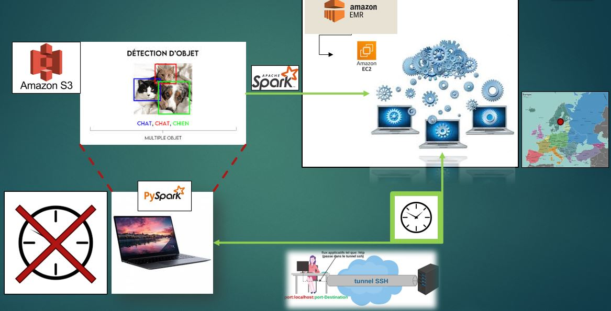

# Big-Data-p9

### Contexte du projet de formation professionnalisant :

En tant que Data Scientist chez "Fruits!", l'objectif est de développer la première chaîne de traitement des données images pour une application mobile de reconnaissance de fruits, permettant aux utilisateurs de photographier un fruit et d'obtenir des informations détaillées à son sujet. Ce projet vise à sensibiliser le public à la biodiversité des fruits et à établir un moteur de classification d'images. Le dimensionnement des instance AWS EMR devra prendre en compte l'augmentation rapide des volumes de données.

### Tâches principales :

* **Analyse du notebook existant** :

Compréhension du notebook réalisé par un alternant, incluant le jeu de données d'images de fruits et leurs labels.

* **Configuration d'AWS EMR** :

Mise en place d'une instance EMR opérationnelle pour le traitement des données à grande échelle, conforme aux normes RGPD.

* **Complétion du script PySpark** :

Ajout d'un traitement de diffusion des poids du modèle TensorFlow sur les clusters.

* **Implémentation de PCA en PySpark** :

Intégration d'une réduction de dimension de type PCA pour une analyse plus efficace des données.

* **Validation et test du pipeline** :

Exécution et validation du pipeline sur AWS EMR pour assurer robustesse et scalabilité.

* **Documentation détaillée** :

Rédaction d'une documentation complète expliquant le script PySpark, la configuration EMR, les choix technologiques et les considérations RGPD.

* **Critique de la solution** :

Évaluation des avantages et des limites de la solution, avec des suggestions d'améliorations.

* **Préparation de la démonstration** :

Préparation d'une démonstration pour présenter l'instance EMR et le script PySpark, illustrant la reconnaissance des fruits à partir d'images.

## Livrables : 
* **Gamba_Lucas_1_notebook_062024** :
  Notebook Jupyter de la chaîne de traitement PySpark contenant la partie testé en local et la partie éxecuté sur le cluster AWS EMR.
* **Gamba_Lucas_3_presentation_062024** :
  Présentation Power Point de la architecture de la solution Big Data déployée et de la chaîne de traitement créée.
